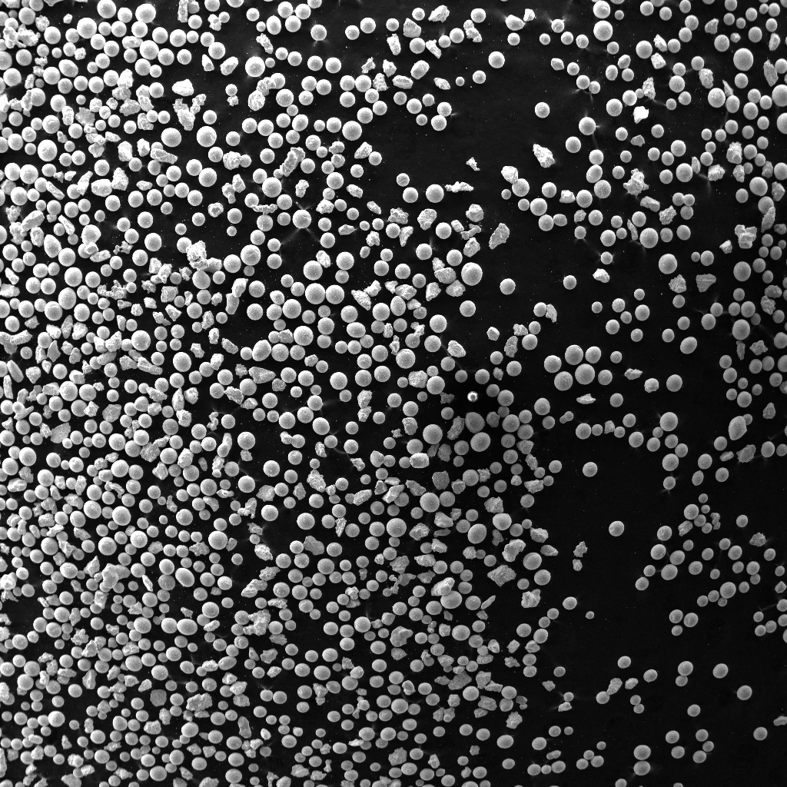
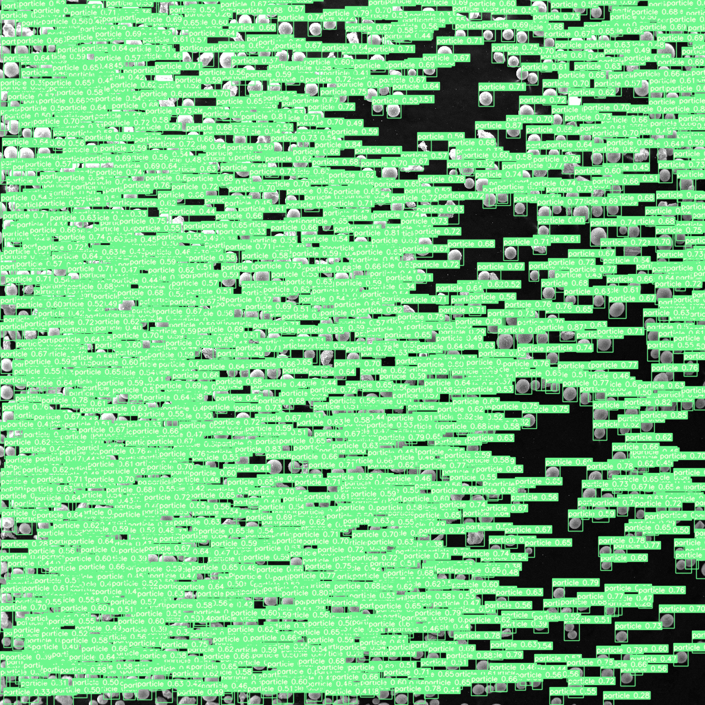

# Nuclear_IT_HACK_2023
Repo with code written during Nuclear_IT_HACK (29-30 April 2023). Our team worked on "Image Analisys from TermoNuclear Reactor" (all data you can find by contacting me). The task was about detecting particles of metal dust. We implement this with 3 methods: contour detection, kmeans and YOLOv7 tiny.
   
### Here is an example of image:  

### And here is output image with detected particles:  
